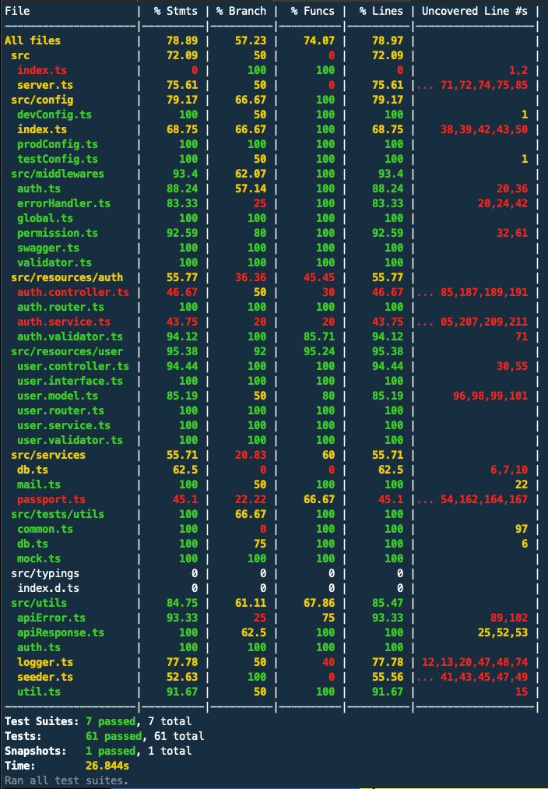
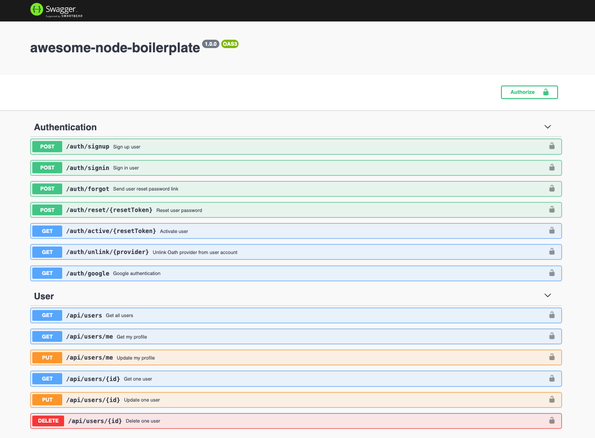

# Awesome Node boilerplate

A boileplate for REST API focuses on separation of concerns and scalability

## Table of content

---

- [Features](#features)
- [Prerequisites](#prerequisites)
- [Getting started](#getting-started)
- [Testing](#testing)
- [Deployment](#deployment)
- [Project structure](#project-structure)

## Features

---

### **Separation of concerns with multilayer structure**

- API concerns namely _Router_, _Middleware_, _Controller_ and _Service_ are all abstracted to their own layer. This will be clarified later in Project structure section.
- _API response_ and _Error handling_ are also configured to be highly reusable and scalable out of the box.

### **Fast development environment with cutting-edge ES6 features**

- [Nodemon](https://www.npmjs.com/package/nodemon) reloads server in every change which helps development faster.
- [Winston](https://github.com/winstonjs/winston) makes logging informative and illustrative
- ES6 new features out of the box with [Babel](https://babeljs.io/) configuration.

### **Typechecking with [TypeScript](https://www.typescriptlang.org/docs/tutorial.html)**

### **Testing**

- Test suites use [Jest](https://jestjs.io/docs/en/configuration) and [Supertest](https://github.com/visionmedia/supertest) out of the box.

Test coverage


### **Authentication and authorisation**

- JWT authentication.
- Signup with email and password
  _ Email verification with [Sendgrid](https://sendgrid.com/).
  _ Account validation and activation.
- Signin with email and passport with [Passport local strategy](http://www.passportjs.org/packages/passport-local/).
- Oauth 2.0 authentication with [Passport Google Strategy](http://www.passportjs.org/packages/passport-google-oauth/).
- Reset password.
- Authorisation is configured for user and admin roles. This could be easily extended for more roles.

### **API documentation**

- [Swagger](https://swagger.io/) makes testing routes to be no-hassle.



### **Database integration**

- The first version of this boilerplate uses [MongoDB](https://www.mongodb.com/) with [Mongoose](https://mongoosejs.com/).

### **CRUD users**

### **Security**

- [HelmetJS](https://helmetjs.github.io/) and [Express Rate Limit](https://github.com/nfriedly/express-rate-limit) are configured to add extra security layers to the API.

### **Email sending**

- The boilerplate uses [Sendgrid](https://sendgrid.com/) for email-related jobs.

### **Searching, sorting and pagination**

### **Linting**

- [Prettier](https://github.com/prettier/prettier) customise and commonise code format.
- [Linstaged](https://github.com/okonet/lint-staged) and [Husky](https://github.com/typicode/husky) are configured for running formatting scripts right before commiting new changes.

### **Continous integration**

- Use [TravisCI](https://travis-ci.org/) for testing and managing development branches.

## Prerequisites

---

- [NodeJS](https://nodejs.org/en/).
- [MongoDB](https://www.mongodb.com/).
- IDE of your choice.
- Command Line Tools.

## Getting started

---

Install dependencies

```bash
  npm install
```

Run MongoDB locally

**MacOS**

```bash
  sudo mongod
```

Run development server

```bash
  npm run dev
```

## Testing

---

Configuration for Jest could be found in [`jest.config.js`](jest.config.js).

### Running test

Running all test suites with coverage:

```bash
  npm run test
```

Running and watching for changes in one particular test file:

```bash
  npm run test:watch src/tests/api/auth/api.test.ts
```

## Deployment

---

### **Deploy with Heroku**

- Install [Heroku CLI](https://devcenter.heroku.com/articles/heroku-cli).
- Create a new app on [Heroku Dashboard](https://devcenter.heroku.com/articles/heroku-dashboard).
- Login to your Heroku account in command line tool:

```bash
  heroku login
```

- Create a Heroku remote from your app's name:

```bash
  heroku git:remote -a your-app-name
```

- Rename production branch if you want to:

```bash
  git remote rename heroku production
```

- Deploying:

```bash
  git push production master
```

## Project structure

---

The boilerplate is abstracted to different layers based on the notion of concerns separation and clarity.

### **Root server file: [server.ts](src/server.ts)**

- Initialize Express app, environment variables, logging, global middlewares and routing.
- Run Passport configuration
- Connect to MongoDB

### **Global middleware: [global.ts](src/middlewares/global.ts)**

This is where we initalize all global middlewares. Those will be used in _any_ routes.

### **Environment configurations [config](src/config/index.ts)**

Configurations including API keys, environment variables and specific setups for _development_, _production_ or _test_ env. You can find those in other config files in this directory.

### **Routers and resources: [user](src/resources/user/user.router.ts) and [auth](src/resources/auth/auth.router.ts)**

Here is where core of the API is located. Each **resouce** is divided into different layers:

- **Router** (`resource.router.ts`)
  _ Initialise routes.
  _ Add specific **authorisation** and **middlewares** for each route. \* Connect route with equivalent **controller**
- **Interface** (`resource.interface.ts`) \* **Types** that are used by layers of the resource
- **Model** (`resource.model.ts`) \* Define **model** for the resource based on database schema.
- **Controller** (`resource.controller.ts`) \* A bridge between **router** and **service** layer. This controller layer take input from client side queries, send to service layer. Then it gets back either data that the client wants, or error in case of failure, and send back to the client.
- **Service** (`resource.service.ts`) \* The deepest layer of the API where actual database queries and operations are performed. This is also the only layer that does this job.

### **Server reponse (success or error) [apiResponse.ts](src/utils/apiResponse.ts)**
